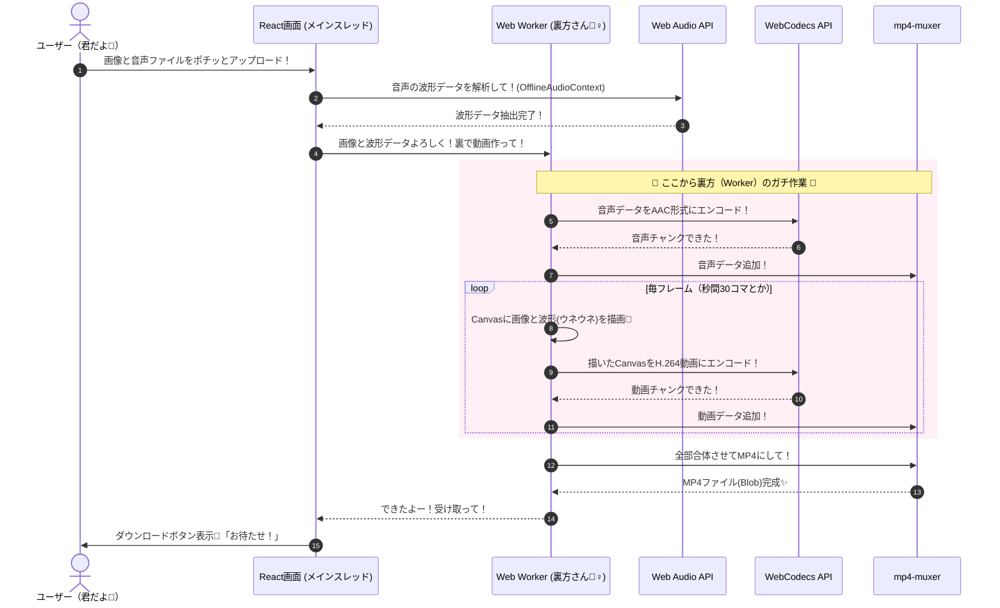

# 【AI Studioフル活用✨】ブラウザだけで動く最強の波形動画ジェネレーター作ってみた✌️💖

> **🚨 注意書き（代筆者より） 🚨**  
> やっほー！✌️✨ 突然だけど、この記事は筆者（エンジニア）の親友の「うち（20代ギャル）」が代筆してるよー！💖 筆者が「Qiitaに記事書きたいけど文章硬くなるの無理み💦」って言ってたから、うちが代わりに超分かりやすくポップに解説していくね！専門用語もギリギリまで噛み砕くから、とりま最後まで読んでって〜！🥺✨

---

## 🎧 何作ったの？てかマジ見てこれ！

今回うちらが**Google AI Studio**を使って爆誕させたのが、この「**Waveform Generator**」！🔥  
普通にパブリック公開してるから、スマホでもPCでもガンガン使ってみてほしい！

👉 **[Waveform Generatorを今すぐ使う！(https://waveform-gen.nulltan.dev/)](https://waveform-gen.nulltan.dev/)**
もう独自ドメインも取っちゃったし、ガチで運用していくスタイル卍

**「好きな画像」**と**「音声ファイル（MP3とか）」**を入れるだけで、音楽に合わせて波形がウネウネ動く **1枚絵の動画（MP4）** が作れちゃう超神ツールだよ！✨

よくYouTubeとかX（旧Twitter）にある、ボカロ曲のMVとか、推しの「歌ってみた」動画みたいなやつが**ブラウザだけで完結して作れる**のがガチでヤバいポイント。サーバーに動画送ったりしなくていい（全部君のスマホやPCの中で処理する！）から、通信量かからないし、未公開の音源でもプライバシー的に超安心っしょ？✌️

### 🤔 てか、なんで作ろうと思ったの？
ぶっちゃけ、周りの友達や配信者の子が「歌ってみたとかラジオの切り抜き動画作りたいけど、動画編集ソフト重いしムズくて詰む…🥺」ってよく言ってて。
「え、じゃあブラウザで画像ポイッ、音源ポイッてやるだけで動画できたら超天才じゃね？」ってなったのがキッカケ！
で、筆者に「AIに課金してなんか作ってよー」って無茶振りしたら、これができたってワケ！ウケる笑

---

## ✨ ここが推し！こだわりの神機能たち

ただ動画作れるだけじゃないよ？うちと筆者のこだわりが詰まってるから見て！

1.  **波形のリアルタイムプレビュー機能 👀**
    *   動画書き出す前に、「どんな感じでウネウネするかなー？」って画面上で確認できるの！これあるとやり直し減ってマジ助かる。
2.  **解像度＆FPSも自由自在 🎞️**
    *   「Twitter用だから軽くしたい」とか「YouTube用にヌルヌル高画質で！」とか、設定でいじれるようにした！1080pの60FPSとかもイケるよ！🔥
3.  **波形の色も変えられちゃう 🎨**
    *   推しのメンバーカラーに波形の色を合わせるの、絶対やりたいっしょ？カラーピッカーで秒で変えられるよ💖

---

## 🛠️ うちらの最強技術スタック（使ったツールたち）

「え、でもブラウザだけで動画って重くない？てかどうやってんの？💦」って思うじゃん？  
そこで使ったのがこのモダンでイケてる技術たち！ここからちょっと真面目な話ね！

*   **React + Vite + TypeScript** ⚡
    *   フロントエンドの王道！画面サクサク動くし、開発ペースも爆速！TypeScriptあるとめっちゃエラー防げるらしい。知らんけど！
*   **Tailwind CSS** 🎨
    *   デザイン秒で終わる！おしゃれなUI作るならこれ一択みある。うちみたいに「可愛くして！」って言うだけでサクッとやってくれる。
*   **Web Audio API (OfflineAudioContext)** 🎶
    *   音楽のデータを読み込んで、どのタイミングでどれくらいデカい音が出てるか（波形データ）を抽出する神API。
*   **WebCodecs API & [mp4-muxer](https://github.com/Vanilagy/mp4-muxer)** 🎬
    *   ここが一番のエグいポイント！**ブラウザの力だけで動画と音声を合体させてエンコード（MP4化）**できちゃう！これまでのWebの常識覆してる感あってヤバくない？
*   **Web Worker** 👷‍♀️
    *   動画のエンコードってマジで重い作業（鬼タスク）なんだけど、これを「裏方のスタッフ（別スレッド）」に任せることで、画面が固まらないようにしてるよ！ウケるくらいスムーズ！

---

## 🔄 処理のフロー（どうやって動いてるか）

「で、中身どうなってるの？」って人のために、**Mermaid**（図を書くやつ）で描いてみたよ！✨ 
英語並んでるけど、要は「裏方に投げて処理して合体！」って感じ！

---

## 🥵 ぶっちゃけマジで詰まったポイント（AIが助けてくれた💖）

作るのめっちゃ楽しかったけど、ガチで苦戦したエラーもあったんよね💦
でも、AIの相棒が超優秀で、一緒に解決してくれたから聞いて！

1.  **エンコード中にブラウザが突然お亡くなりになる事件（OOM問題）**
    *   **症状:** 「よし、動画生成！」ってボタン押した瞬間、処理が早すぎてメモリがパンク（Out of Memory）して、ブラウザが勝手にリロードされちゃってたの🥺「えっ、終わったんだけど💦」ってガチギレしそうになった。
    *   **解決策:** エンコーダーのキュー（待ち行列）がいっぱいになったら、処理を少し「待て🐶（`await new Promise`）」させる作戦で解決！AI StudioのAIちゃんが「キュー監視してストッパーかけよ？」ってコード書いてくれてマジ助かった🔥
2.  **音声と動画の同時進行**
    *   **症状:** 最初は「音声全部終わらせてから動画！」って順番にやってたんだけど、それだと進捗バーの表示が進まなくて「フリーズした！？」って勘違いしやすくて体験イマイチだったの。
    *   **解決策:** `Promise.all`を使って、音声のエンコードと動画のエンコードを並行して進めることに！しかもプログレスバー用に「今全体の何％？」って計算するロジックもAIが秒で組んでくれて、爆速＆進捗もスムーズになったよ✨

---

## 🤖 まとめ：Google AI Studio、マジで神コスパ✨

てか今回、このアプリのコーディングほぼ全部**Google AI Studio**にお願いしながら作ったんだけど、マジでヤバくない！？✨

「ここエラー出た🥺」「ここもっと速くしたい！」ってチャットするだけで、複雑なWebCodecsとかWorkerのコードを一瞬で直してくれるの！しかもインフラとか環境構築もAI Studioが勝手にやってくれるから、うちらは**「どんなアプリにしたいか」を考えるだけでOK**！

エンジニアの君も、プログラミング初心者で「なんかアプリ作りたいなー」って思ってる君も、**とりまAI Studio使ってみるしかないっしょ！🔥**

ぜひうちらが作ったツールも遊んでみてね！
👉 **[Waveform Generatorで遊ぶ！(https://waveform-gen.nulltan.dev/)](https://waveform-gen.nulltan.dev/)**

記事読んでくれてありがとー！よかったら「LGTM（いいね）」押してってね！じゃーね！✌️💖✨
